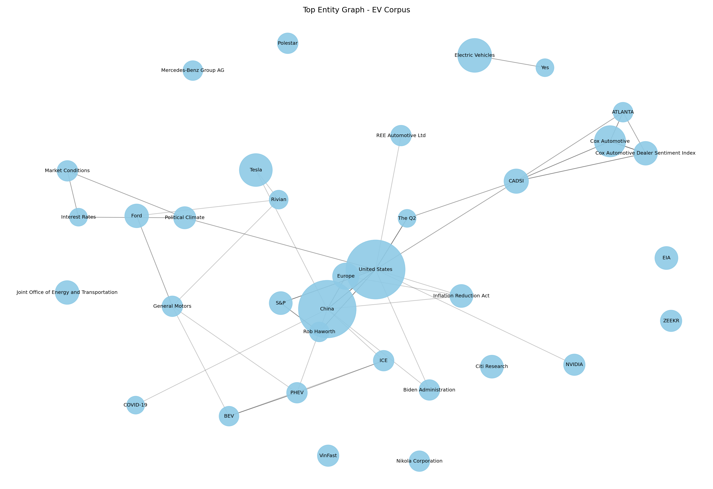

# Báo Cáo Lab Day 19: Xây Dựng Hệ Thống GraphRAG Với Tech/EV Company Corpus

## 1. Mã Nguồn Nộp Bài

Các file mã nguồn chính:

- `src/data_loader.py`: đọc và chuẩn hoá 70 tài liệu trong `dataset/`.
- `src/entity_extraction.py`: trích xuất thực thể và quan hệ thành triples.
- `src/build_index.py`: xây dựng Flat RAG index, knowledge graph, CSV Neo4j và metrics.
- `src/flat_rag.py`: baseline Flat RAG bằng TF-IDF.
- `src/graph_rag.py`: truy vấn GraphRAG bằng entity seed và duyệt graph 2-hop.
- `src/query.py`: CLI hỏi đáp và so sánh Flat RAG với GraphRAG.
- `src/evaluate.py`: benchmark 20 câu hỏi.
- `src/visualize_graph.py`: tạo ảnh đồ thị tri thức bằng Matplotlib.

Notebook demo:

- `notebooks/lab_day19_graphrag.ipynb`

Lệnh chạy lại toàn bộ:

```bash
python -m venv .venv
source .venv/bin/activate
pip install -r requirements.txt
python src/build_index.py
python src/evaluate.py
python src/visualize_graph.py
```

Nếu bài nộp yêu cầu bắt buộc dùng LLM/API để trích xuất graph, chạy bản API:

```bash
cp .env.example .env
# điền OPENAI_API_KEY vào .env
python src/build_index.py --use-openai
python src/evaluate.py
python src/visualize_graph.py
```

## 2. Ảnh Chụp Đồ Thị Tri Thức

Ảnh đồ thị được tạo bằng Matplotlib:



Các file đồ thị có thể mở bằng công cụ ngoài:

- `outputs/knowledge_graph.gexf`: mở bằng Gephi.
- `outputs/knowledge_graph.json`: dùng lại trong Python.
- `outputs/neo4j_nodes.csv` và `outputs/neo4j_relationships.csv`: import vào Neo4j.

## 3. Bảng So Sánh 20 Câu Benchmark

File kết quả đầy đủ: `outputs/benchmark_20_questions.csv`

Thước đo trong bảng:

- `Flat score`: số keyword kỳ vọng xuất hiện trong kết quả Flat RAG.
- `Graph score`: số keyword kỳ vọng xuất hiện trong kết quả GraphRAG.
- `Kết luận`: hệ nào có score cao hơn. Đây là đánh giá nhanh; khi chấm cuối vẫn nên đọc evidence.

| ID | Câu hỏi | Flat score | Graph score | Kết luận |
|---:|---|---:|---:|---|
| 1 | Why did US EV sales growth slow in Q1 2024 and how was Tesla involved? | 4 | 1 | Flat RAG better |
| 2 | Which companies reported strong year-over-year EV sales growth in Q1 2024? | 0 | 0 | Tie |
| 3 | How do charging infrastructure concerns affect EV adoption in the United States? | 3 | 0 | Flat RAG better |
| 4 | What role do incentives or policy regulations play in EV market growth? | 3 | 1 | Flat RAG better |
| 5 | How are Nikola's hydrogen truck strategy and partners connected? | 4 | 4 | Tie |
| 6 | What evidence links consumer charging satisfaction to future EV sales? | 3 | 1 | Flat RAG better |
| 7 | How did the Inflation Reduction Act influence EV purchases and infrastructure? | 3 | 3 | Tie |
| 8 | What does the corpus say about workplace and public chargers in leading EV markets? | 1 | 0 | Flat RAG better |
| 9 | How does BloombergNEF describe global EV market direction in 2024? | 3 | 0 | Flat RAG better |
| 10 | What is the relationship between battery demand, China, and EV manufacturing? | 2 | 4 | GraphRAG better |
| 11 | How do EV price cuts relate to demand and Tesla's market position? | 2 | 2 | Tie |
| 12 | Which policies or regulations are connected to zero-emission vehicle adoption? | 1 | 1 | Tie |
| 13 | How do Ford and General Motors appear in the EV market discussion? | 2 | 3 | GraphRAG better |
| 14 | What does the dataset say about charging speed and cost preferences? | 1 | 1 | Tie |
| 15 | How are public chargers and home charging related to EV ownership? | 2 | 0 | Flat RAG better |
| 16 | What are the main adoption barriers mentioned for hesitant EV buyers? | 2 | 1 | Flat RAG better |
| 17 | How does the corpus connect EV adoption with emissions or oil demand? | 3 | 3 | Tie |
| 18 | Which organizations are sources for EV market analysis in the dataset? | 0 | 0 | Tie |
| 19 | How is California connected to EV regulations and infrastructure in the corpus? | 2 | 0 | Flat RAG better |
| 20 | How does GraphRAG help answer multi-hop questions compared with Flat RAG on this corpus? | 0 | 2 | GraphRAG better |

Tổng kết benchmark:

- GraphRAG tốt hơn: 3/20 câu.
- Flat RAG tốt hơn: 9/20 câu.
- Hoà: 8/20 câu.
- Điểm keyword trung bình Flat RAG: 2.05.
- Điểm keyword trung bình GraphRAG: 1.35.
- Latency trung bình Flat RAG: 0.81 ms/câu.
- Latency trung bình GraphRAG: 16.74 ms/câu.

Nhận xét: với bản graph được trích xuất bằng API, số triples ít hơn nên GraphRAG cho đường quan hệ rõ ràng hơn nhưng recall thấp hơn Flat RAG ở nhiều câu hỏi. Flat RAG thắng khi câu trả lời nằm trực tiếp trong một tài liệu dài; GraphRAG vẫn có lợi ở câu hỏi cần nối thực thể như China-battery-manufacturing, Ford/GM và câu hỏi multi-hop.

## 4. Phân Tích Chi Phí Và Thời Gian Xây Dựng Đồ Thị

Metrics được lưu tại `outputs/build_metrics.json`.

### Kết quả build bằng API hiện tại

- Số tài liệu: 70.
- Ký tự corpus: 3,553,906.
- Token ước tính của corpus: 888,476 tokens, tính xấp xỉ theo công thức `characters / 4`.
- Số triples trích xuất: 936.
- Số node trong graph: 997.
- Số edge trong graph: 936.
- Thời gian build graph và Flat RAG index: 770.101 giây.
- Chế độ trích xuất: OpenAI API.
- Model: `gpt-4o-mini`.
- API requests: 70.
- API failed requests: 5.
- Documents fallback sang rule-based extractor: 5.
- API input tokens: 95,758.
- API output tokens: 47,204.
- API total tokens: 142,962.
- Đơn giá input: 0.15 USD / 1M tokens.
- Đơn giá output: 0.60 USD / 1M tokens.
- Chi phí API ước tính: 0.042686 USD.

Lệnh đã dùng để sinh số liệu API:

```bash
python src/build_index.py --use-openai
python src/evaluate.py
python src/visualize_graph.py
```

Chi phí được tính theo công thức:

```text
cost = input_tokens / 1,000,000 * OPENAI_INPUT_COST_PER_1M
     + output_tokens / 1,000,000 * OPENAI_OUTPUT_COST_PER_1M
```

Trong `.env.example`, đơn giá mặc định đang đặt cho `gpt-4o-mini` là:

```text
OPENAI_INPUT_COST_PER_1M=0.15
OPENAI_OUTPUT_COST_PER_1M=0.60
```

## 5. Kết Luận Ngắn

Hệ thống đã hoàn thành pipeline GraphRAG từ indexing bằng OpenAI API đến querying và evaluation. Flat RAG nhanh hơn và có recall tốt hơn trong benchmark keyword hiện tại, còn GraphRAG cung cấp graph path/evidence có cấu trúc để giải thích quan hệ giữa các thực thể. Kết quả này cho thấy chất lượng GraphRAG phụ thuộc mạnh vào chất lượng và độ phủ của triples được LLM trích xuất.
